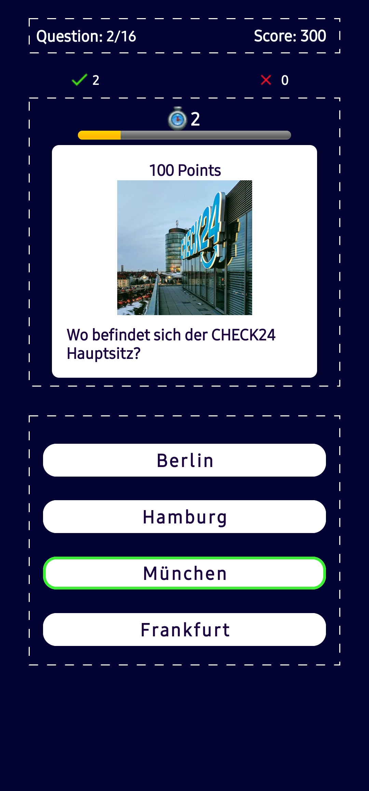

# Quiz: Beat the high score

Welcome to the Quiz App! This application allows users to test their knowledge through a series of questions and keep track of their high scores. The app consists of two main views: the Main Menu and the Question Page.

## Main Menu

The Main Menu is the starting point of the app and offers the following actions and views:

1. **Title of the App:** The app's name is prominently displayed at the top of the Main Menu.
2. **Start New Game:** Users can initiate a new quiz game by selecting this option.
3. **High Score:** The highest score from previous quiz rounds is displayed, encouraging users to beat their own records.

## Question Page

The Question Page presents users with a series of questions to answer, each containing the following elements:

1. **Header:**
   - Number of Questions: Displays the current question's position in the quiz (e.g., "Question 2 of 10").
   - Current Score: Shows the user's current score as they progress through the quiz.
   - Correct and Wrong Answer Counter: Keeps track of the number of correct and incorrect answers.

2. **Question Area:**
   - Question Card: Displays the question to be answered, along with optional images.
   - Question Score: Indicates the score assigned to the current question.
   - Countdown Timer: A timer that counts down the time remaining to answer the question.

3. **List of Answers:**
   - Answers are presented in random order to challenge users' knowledge.
   - Correct Answer: If the user selects the correct answer, it is highlighted in green, and a correct answer sound is played.
   - Incorrect Answer: If the user selects an incorrect answer, the chosen answer is shown in red, and the correct answer is displayed in green, accompanied by an incorrect answer sound.- After Answering: Once an answer is chosen, clicking on other answers is disabled for a short period.
   - End of Game: After answering the last question, users can return to the Main Menu. If the user beats the previous high score, it is updated and displayed.

## Important Notes

- The questions for the quiz are fetched from a JSON file located at: [Data](https://herosapp.nyc3.digitaloceanspaces.com/quiz.json).
- Retrofit is used to fetch data from the JSON file.
- The first-time setup requires an internet connection to retrieve the questions.
- The questions are stored in a Room database for offline use after the initial fetch.
- High scores are persisted using the Room database, ensuring they are retained even after restarting the app.

Feel free to explore the codebase and contribute to the development of this engaging Quiz App!

---

For installation: [Drive][https://drive.google.com/file/d/12a0L-ROW5xPhalgGDEZrAr_rAFLfU1Uk/view?usp=drive_link).

If you encounter any issues or have suggestions for improvement, please [open an issue](link-to-issue-tracker) or submit a pull request.

Happy quizzing!

---

## Screenshots

  

    <imgimg src="screenshots/main_page.jpg" alt="Main Menu" width="200"/>
  

  

    
  

